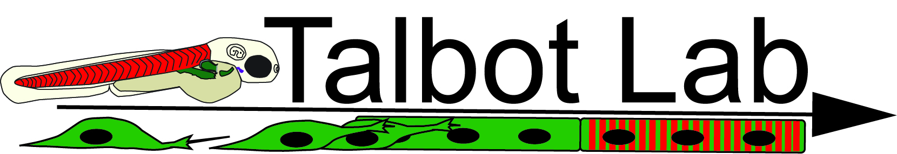
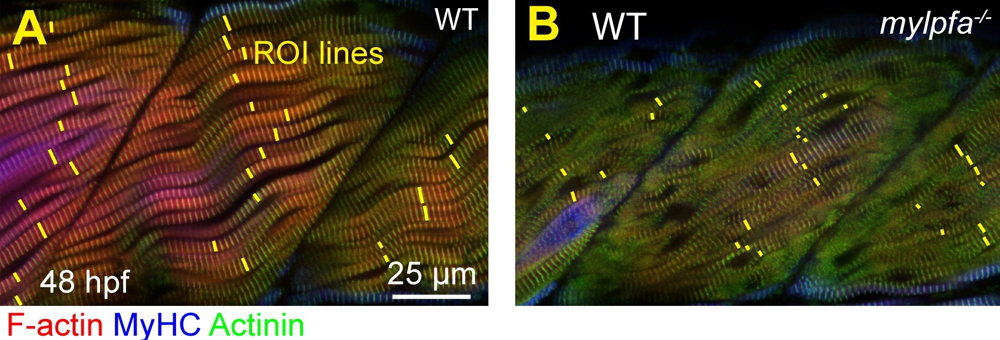
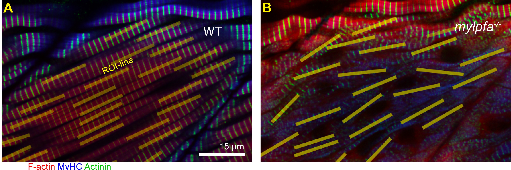
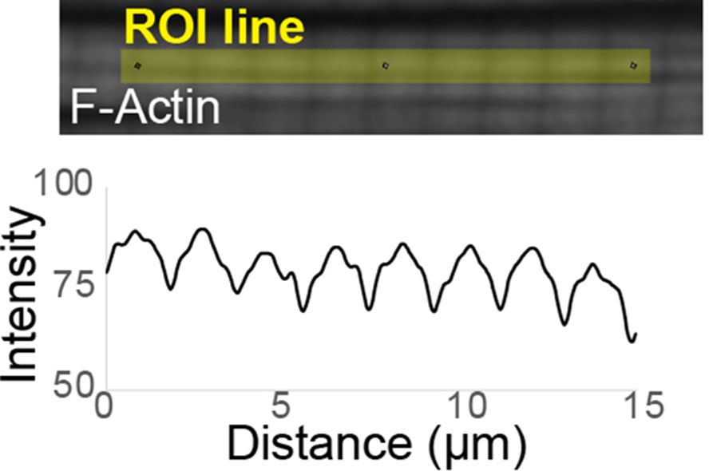
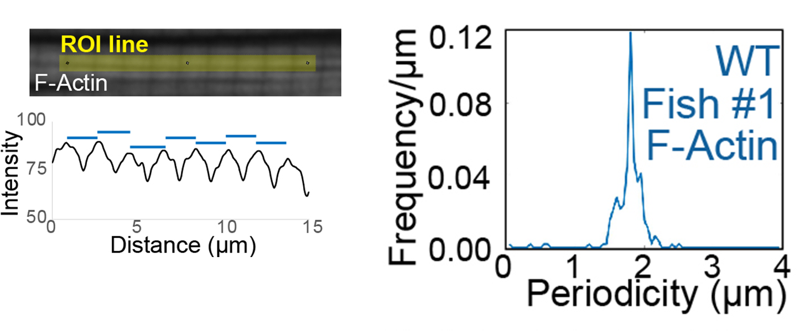
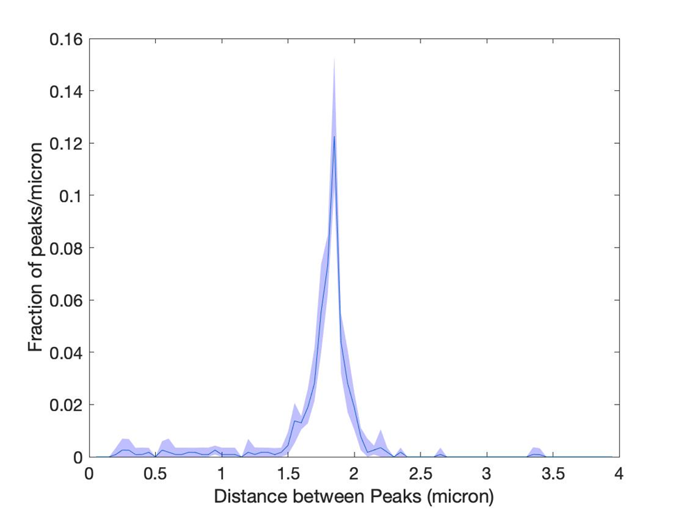
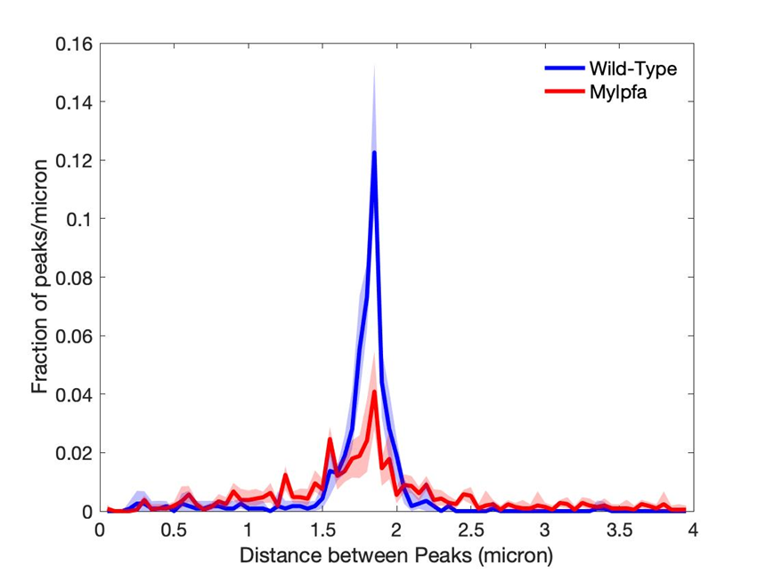
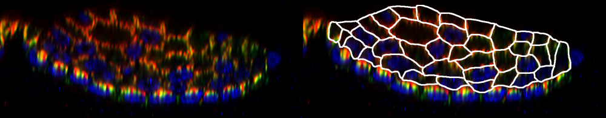

<!---
bibliography: README/myosin-light-chain-proteins-cooperatively-promote-sarcomere-growth-in-fast-twitch-muscle.bib
output:
  html_document:
    df_print: paged
  word_document: default
  pdf_document: default
--->

# Myofibril Quantification Suite

We developed this suite of programs to analyze several aspects of muscle structure. The suite ranges from measurements on sarcomeres, myofibrils, myofibril bundles, to whole myofibers. We also include a simple module for measuring image brightness in defined regions.

This Zenodo snapshot captures the programs used in [Adekeye et al](https://doi.org/10.1101/2024.09.18.613721)

------------------------------------------------------------------------

------------------------------------------------------------------------

## Myofibril Bundle Width & Sarcomere Length

**Associated files:** "[Myofibril_Width_Length_FIJI.ijm](/MyofibrilWidthLength/Myofibril_Width_Length_FIJI.ijm)" & "[Myofibril_Width_Length_MatLab.mlx](/MyofibrilWidthLength/Myofibril_Width_Length_MatLab.mlx)"

**Necessary programs:** [FIJI](https://imagej.net/software/fiji/downloads) & [MATLAB](https://www.mathworks.com/products/matlab.html)

1.  Organize your files. Consolidate all of your experiment files, as .tif files, into a folder. If any are 'flipped', include the string "\_180\_" in the file name

2.  Run the macro "Myofibril_Width_Length_FIJI.ijm" in FIJI. It will prompt you to:

    i.  Load the folder you made in Step 1

    ii. Set the scale

    iii. Draw at least 30 ROI lines (A, B) along the myofibril component (Sarcomere Length or Myofibril Bundle Width) you would like to measure, then press continue. Measure consistently from 1-2 somites. In our analysis we consistently use images of the dorsal half of the somite, but this software is not dependent upon that restriction. We recommend spreading measurements out such that you measure each myofibril bundle only once, and select a local maximum of myofibril bundle width. Select regions where the borders of the myofibril bundle are clearly defined, not ares where they "fade away", usually due to curved surfaces. Region of interest selection varies by stage; up to 3 days post fertilization (dpf) myofibril bundles are typically separated by cytoplasmic space in the cell center, and by 6 dpf they often expand through much of the cell, leaving very little cytoplasmic space in between the myofibril bundles.

4.  The macro will output a set of processed images, a .csv file of distances, and saved ROIs.

5.  Process the resulting data in MatLab using the script "Myofibril_Width_Length_MatLab", which will provide a summary table of each sample and its mean distance. This data can also be processed manually in Excel.

------------------------------------------------------------------------

## Sarcomeric Fraction and Periodicity Histogram

The following steps will generate a Periodicity Histogram, which shows the amount of signal with set periodicity, from 0-4 µm. This can be simplified into a single datapoint, which we term the sarcomeric fraction. To generate a sarcomeric fraction alone, follow steps 1 to 13 of this protocol. To generate a periodicity histogram, continue from steps 14 to 20.

| Programs & Packages | Files from this Github|
|---|---|
| [FIJI](https://imagej.net/software/fiji/downloads) | [SarcomericFraction_FIJI.ijm](/SarcomericFraction/SarcomericFraction_FIJI.ijm) |
| [MATLAB](https://www.mathworks.com/products/matlab.html) with packages: "[Statistics and Machine Learning](https://www.mathworks.com/products/statistics.html)", "[Curve Fitting Toolbox](https://www.mathworks.com/products/curvefitting.html)", "[Image Processing Toolbox](https://www.mathworks.com/products/image-processing.html)", and "[Signal Processing Toolbox](https://www.mathworks.com/products/signal.html)" | Freq_ByPeak & Sum_Peaks code by marker (below)|
| | [combine_samples_with_ci.mlx](/SarcomericFraction/combine_samples_with_ci.mlx) |

| File Name | Marker  |
|---|---|
| [freq_bypeak_Actin_SarcFrac.mlx](/SarcomericFraction/Actin_Codes/freq_bypeak_Actin_SarcFrac.mlx) & [Sum_Peaks_Actin.mlx](/SarcomericFraction/Actin_Codes/Sum_Peaks_Actin.mlx) | Actin |
| [freq_bypeak_Myosin_SarcFrac.mlx](/SarcomericFraction/MyHC_Codes/freq_bypeak_Myosin_SarcFrac.mlx) & [Sum_Peaks_MyHC.mlx](/SarcomericFraction/MyHC_Codes/Sum_Peaks_MyHC.mlx) | MyHC |
| [freq_bypeak_mMacActinin_SarcFrac.mlx](/SarcomericFraction/mMac_Actinin_Codes/freq_bypeak_mMacActinin_SarcFrac.mlx) & [Sum_Peaks_mMacActinin.mlx](/SarcomericFraction/mMac_Actinin_Codes/Sum_Peaks_mMacActinin.mlx) | mMac, Actinin |

**Glossary**
| Sarcomeric Mean     | Gives the mean signal within the defined sarcomeric bins. This signal is high in organized sarcomeres and low in disordered muscle fibers                                                                                         |
|---|---|
| NonSarcomeric | Gives the mean signal that falls outside of the defined sarcomeic bins. This signal is low in muscle fibers with organized sarcomeres and high in fibers with disordered sarcomeres. |
| Fraction sarcomeric | Gives the ratio of Sarcomeric Histosums and NonSarcomeric Histosums. Fraction Sarcomeric has proved to be the most consistent and reliable indicator of sarcomericity, best matching what is visible on inspection of the images. |

#### Generate intensity profiles

1.  Place the files you want to analyze into a single folder (preferably, blinded to group identity)

2.  Run SarcomericFraction_FIJI.ijm (Plugins -\> Macro -\> Run)

3.  The macro will prompt you to enter your scale, which will be used to analyze across the entire folder selected.

4.  An image will pop up to be analyzed. Draw a line across the scalebar to confirm the scaling is accurate. After this, press continue. 

5.  Draw 30 Region of Interest (ROI) lines about 15 µm each across a single fiber type (slow or fast twitch muscle) and add all to the ROI manager. 
    i.  Be sure to orient all ROI lines in the general direction of each fiber type for optimal results. Sample evenly across the somite to avoid sample bias. This can be done by drawing ROI lines in a new myofibril for each ROI then by spreading ROIs across myofibrils to sample an entire somite. 
    ii. Draw lines at a similar density regardless of genotype. A nuclear label can help ensure consistency, because lines tend to be drawn on the cytoplasm or myofibrils that form adjacent to the plasma membrane of the myofiber, and there’s often not a 15 µm span between the nuclei.
    iii. To ensure consistency across images, make sure that the “empty” space in central cytoplasm is sampled when there is enough space for a line. This central space tends to be devoid of sarcomeric markers in the wild type, which may contain these markers in a myofibril mutant.
    iv. When analyzing genetic mosaics, it may be impossible to draw 30 ROIs per sample, For instance, not enough fibers may be labeled for GFP+ or too many may be labeled for GFP- measurements. Ensure that at least 3 muscle fibers have GFP (and lack GFP) before beginning; sample images with minimally 10 lines.

6.  The macro will then split the channels and generate intensity profiles for each image
    

7.  The macro will create sub-folders within the parent folder to store:
    i.  CSV files, separated by channel color
    ii. ROI line data
    iii. Processed images to a separate folder. 

#### Prepare your files

8.  Generate a parent folder for each experimental group, with subfolders:
    i)  "Raw Curated"
    ii) "Sarcomere Histogram"
    iii) "Sarcomere Fraction"
         A.  Within the "Sarcomere Fraction" folder, generate subfolders for each color you will analyze. (Red/Green/Blue)
    iv) If combining replicate experiments, add an "Individual datasets folder" with each set of raw image data and csv files from the SarcQuant macro, then add a "Pooled" folder where you start combining samples

9.  Curate .csv files
    i.  Copy .csv files into the "Raw curated" folder.
    ii. Deblind the filenames
    iii. Build a file-count document, including numbers of images in each experimental group. Use this to check that all files have copied over appropriately, and that each color shows up in appropriate folders (counts should match).
    iv. Standardize file names:  *Group_Well_LabelName_ExptDate_ImagingColor.csv\
        *Ensure that capitalization and spelling is consistent across all Group names
    v.  Double-check file counts and names here.

#### Analyze the Sarcomeric Fraction

10. Paste into each color-named subfolder of .csv files to the appropriate Freq_ByPeak program

11. Distinct programs are used to calculate Sarcomeric Fraction for Actin, MyHC, GFPMylpf, mMac, and Actinin labels. (See [Associated files](#associated-files-1))

12. Run the appropriate FreqByPeak program
    

13. The output of this program shows the Sarcomeric fraction, which is the fraction of repeats in sarcomeric lengths to the total count of identified repeats in any length.
    i.  Running the Freq_ByPeak program above will calculate Sarcomeric / nonSarcomeric / Fraction for each file, and export a single dated .csv file within the subfolder, which you've organized by experimental group
    ii. Open the output file in Excel, and copy-paste into a new Excel file. Do NOT do any manipulations in the original .csv file.
    iii. Add a row with simplified name (e.g. "WT") next to well file name
    iv. We recommend importing to standard statistical software, such as JMP. The primary output is the Sarcomeric Fraction column, however, the "Sarcomeric" and "Non-Sarcomeric" data can give a warning as to whether data has been skewed somehow.
    v.  The Actin version of the program also includes an approximation of sarcomeric length calculations, based on the major peak.

#### Generate a Periodicity Histogram

14. Organize output into subfolders by experimental group

15. Run CombineSamples in each folder

16. Copy 95CI files into a single folder, simplifying the names as you go

17. Add a Sum_Peaks program to this folder
    i.  Modify this to give the colors (Lines 18, 20, 21, 23, 24, 25) and names (Line 33) you want to print out
    ii. Modify this to have appropriate scaling along the Y axis (Line 30)
    iii. Modify this to match the names of combined samples in the MATLAB code to the simplified name explained in 3C above, in all spots formatted as the following: ‘FILENAME’ (Lines 1, 7, 11)

18. Run the Sum_Peaks program. Open the resulting image, modify scale or labels and re-run if needed.\

19. Save the graph as both a .fig file for later editing and whatever file type you use in figures.

20. Analyze the Sarcomeric Fraction.
    i.  Running the Freq_ByPeak program above will calculate Sarcomeric / nonSarcomeric / Fraction for each file, and export a single dated .csv file within the subfolder, which you've organized by experimental group
    ii. Open the output file in Excel, and copy-paste into a new Excel file. Do NOT do any manipulations in the original .csv file.
    iii. Add a row with simplified name (e.g. "WT") next to well file name
    iv. We recommend importing to standard statistical software, such as JMP. Most of our work uses the simple Sarcomeric Fraction column, however, the "Sarcomeric" and "Non-Sarcomeric" data can give a warning as to whether data has been skewed somehow.

------------------------------------------------------------------------

## Myofiber Edge-Center Quantification

**You will need:**

| Image setup | Programs & Packages | Files from this Github |
|---|---|---|
| Take confocal images with good Z resolution (0.5 µm or less)| [MATLAB](https://www.mathworks.com/products/matlab.html) | [PositionAnalysisBatch.m](/Edge-Center/PositionAnalysisBatch.m) |
| Export in XYZ | [MATLAB's "Image Processing Toolbox"](https://www.mathworks.com/products/image-processing.html) | [Position_Analysis_V2.mlx](/Edge-Center/PositionAnalysis.m) |
|Leica's Lightning and other image augments won't affect this output and are safe to use for this analysis. |[MATLAB'S "Statistics & Machine Learning Toolbox"](https://www.mathworks.com/products/statistics.html)|[StainedGlass_Confidence.mlx](/Edge-Center/StainedGlass_Confidence.mlx)|
||[Photoshop](https://www.adobe.com/products/photoshop)|[StainedGlass_SumPeaks.mlx](/Edge-Center/StainedGlass_SumPeaks.m)|

1.  Set up your file structure: Parent folder for the experiment, containing only two subfolders: "Image folder" for raw exports, and a folder named "Segmented" where copies of all images in "Image folder" are saved with the same name but containing the outline layer. In a separate folder.

#### Outline muscle fibers

2.  Open Image file in Photoshop

3.  Save-as with the same filename in your "Segmented" folder from Step 1 above. Using the new file can prevent major problems that would destroy the source file. It also, makes “undos” easier.

4.  Add a new layer in the new file. This step allows you to use the "erase" function.

5.  Set up the “Pencil” tool - 5 pixel width, color = white (255,255,255).

6.  Outline the muscle fibers in this new layer. By following the subsequent rules, we consistently segment the whole image area and the segments look typical for a myotome cross section.
    i.  Assume that myofibrils sit on the medial edge of myofibers and begins with F-Actin - so, the white line is slightly medial to the red edge. If two fibers are adjacent, draw the line down the middle.
    ii. Myofibers have at most one nuclei in cross section, but 0 is fine
    iii. A “double-layer” of myofibril indicates the boundary between two myofibers.
    iv. Interior myofibrils indicate a cell boundary, especially when a cell looks way too big (even when the fibrils are sparse)
    v.  Only bifurcate the myofibers if there is some evidence suggesting that it should be bifurcated- like a line with an edge going down the center.
    vi. Only include complete myofibers (not ones missing part of the signal because Z-stack was too shallow.)
    vii. Fast-twitch myofibrils cannot extend into the slow-twitch domain.
    viii. Don’t outline any fibers in the slow-twitch domain.

7.  Save the segmented image.

    i.  Before saving, double-check that has located in the correct “Segmented” folder.

    ii. Also ensure that you have the “Smooth rendering” icon selected, which ensures that the Z and Y pixel distances will match.

#### Calculate brightness by position from edge to center

8.  Put the Position Analysis MATLAB files (PositionAnalysis.m & PositionAnalysisBatch.m) together in the folder containing your segmented images.

9.  Open folder with files and PositionAnalysis.m in Matlab

10. Update Line 8 in PositionAnalysis.m with your correct pixels/micron

11. Run PositionAnalysisBatch.m, navigating to the appropriate folder. This will segment the files based on your line drawings

12. Look carefully at each image and make sure segments are correct. Tiny gaps in line drawings lead to giant gaps in the segmentation file. These are easy to spot by color.

    i.  If you find gaps: Go back through your segmentation files and close any gaps that are found this way.

    ii. Delete the giant set of files produced by this program.

    iii. Re-run PositionAnalysisBatch.m. This time, the image check should look good.

14. Transform+compile the xls files. Initially, image files are listed with red, green, blue columns per fish. This needs to be converted into a new file with one color per genotype. Name the new Excel file by genotype & color (e.g. "WTRed"). Find the genotype with the highest row counts (longest column A) and use that as your column A "Distance" for all sheets. Then, paste in all the "red" columns from the appropriate genotype outputs, adding 0s to fill out any columns that are shorter than the Distance you set, and change row A to an identifier for the fish in case you need to check your data. All files taken at a given resolution can be merged together this way. You will generate one file per genotype per color. (e.g. 5 genotypes, 3 colors = 15 files).

    i.  If files are taken at different resolutions, then they first need to binned into rows that are shared across resolutions. This can be done using the Sum function, and reiterated, because each resolution uses the same row counts. Resolutions can be slightly offset from the initial bins, so we recommend manually confirming each bin is correct the first time through. Once set, it can be used across all datasets. Copy\>paste-special\>values of the merged re-binned data into a file. Left column has bin name ("Distance"), then subsequent files are the data per well.

15. Make a new folder with a copy of all files for normalization. Then, sum each column to find total intensity in image region. Then calculate =100\*Cell/Sum. (Sum can be simplified for filling, e.g. B\$26). Sum the resulting table- all column sums should = 100. Copy- paste data into a new file, which is now normalized as a percent of total intensity by distance. Ensure that the column title is still intact, and that the table doesn't extend past the "Distance" column, as trailing 0s in cells can cause errors

16. Place program “StainedGlass_Confidence” in the parent folder of the files (e.g. parent —\> Confidence + Red, Green, Blue folders). Each child folder contains one .xls file per group (e.g. Red \> WTRed, MutantRed) that has the data for which you wish to determine confidence intervals (CI).

17. Run the program “StainedGlass_Confidence”. Here, for the first time, you will see the plots with confidence intervals for each genotype.

18. Move all ".95CI\_.mat" files to a single folder to combine subgroups

19. Use the program “StainedGlass_SumPeaks” to overlay outputs of different groups. This code will need to be modified for each genotype/group you want to include

    i.  Make sure the file names in lines 1, 7, and 11 match the file names output in 8, and expand if needed for more than 3 groups (In our file, we demonstrate code to combine the three colors for a given genotype.)
    ii. Check that the colors in lines 20-27 ('r', 'g', and 'b' in our file) match what you want to output
    iii. Repeat for each group

20. Use the 95% confidence intervals from the bootstrap program to determine confidence in difference between groups.

------------------------------------------------------------------------

## Image Brightness

**Associated Files:** [GrayscaleMacro_FIJI.ijm](/ImageBrightness/GrayscaleMacro_FIJI.ijm) & [MeanGrayscale.m](/ImageBrightness/MeanGrayscale.m)

1.  Prepare your images by putting all of your experiment files, as .tif files, into a folder. If any are 'flipped', include the string "\_180\_" in the file name.
2.  To measure image brightness use the macro "GrayscaleMacro_FIJI" in FIJI. This program will prompt you for next steps. Then, process the resulting data in MatLab using the program "MeanGrayscale.m".
3.  The resulting data is ready for further processing in statistical software.

------------------------------------------------------------------------

## License

[GNU GPLv3](https://www.gnu.org/licenses/gpl-3.0.html) (c) Talbot Lab
